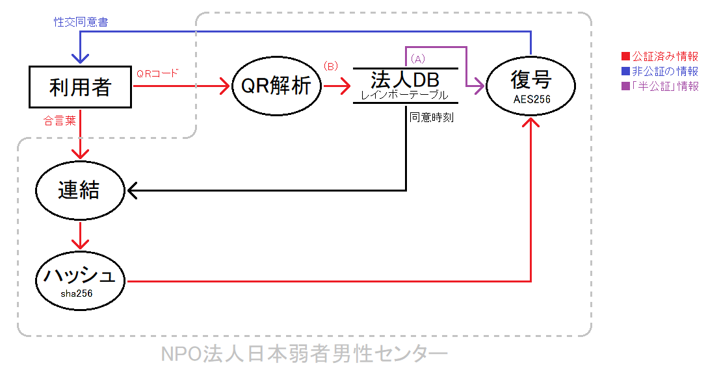

# 性交同意公正証書
[特定非営利活動法人法人日本弱者男性センター](https://men.or.jp/) (以下「法人」) で提供を検討している、  
性交の同意に関する証拠を  
- 安全
- 気軽
- 秘密

に保全するためのシステムである。  
利用者は、2人1組のカップルを想定する。
 
## デモ  
[ダウンロード](https://github.com/hiratatomotaka/sex_agree/archive/refs/heads/main.zip)

## 性交同意公正証書のデータフロー図
### 暗号化

- 入力: 性交同意書  
- 出力: QRコード (暗号化済み性交同意書)  
- 必要なもの:
  - 合言葉(公証済み)
  - 同意時刻
- 副作用: 法人サーバ記憶
- 処理内容:  
フロー図の通り、合言葉と同意時刻からハッシュ値を計算し、このハッシュ値を鍵として性交同意書を暗号化する。  
暗号文がそのまま出力となるのではなく、**暗号文のハッシュ値** が QRコードとして出力される。

### 復号

- 入力: QRコード (暗号化済み性交同意書)
- 出力: 性交同意書
- 必要なもの:
  - 「暗号化」で副作用を受けた法人サーバ
  - 合言葉(公証済み)
- 処理内容:
QRコードの写った写真を受け取ると、読み取られたデータを元に法人サーバへの問い合わせを行う。
問い合わせの結果 暗号文と同意時刻が特定される。
合言葉と同意時刻からハッシュ値を計算し、このハッシュ値を鍵として暗号文を復号する。  
復号結果がそのまま出力される。  
QRコードのデータは暗号文ではなく、あくまでもハッシュ値であるため、 **レインボーテーブルしていない限り復号は不可能** である。
レインボーテーブルは法人サーバが管理する。

## 想定される攻撃とその防御

### 1. 同意の有無に関するトラブル
性交について、事後にその同意の有無や内容で争いとなった場合、性交同意書を証拠として用いた紛争解決を図ることが望まれる。  
しかし、性交同意書の信用が争点に含まれることも考えられる。  
性交同意書の信用を争う場合として、
- 否認 (性交同意書の作成自体を否定する場合)
- 改ざん・捏造 (性交同意書の内容の一部または全部を否定する場合)

が考えられる。  
これらに対しては、次の4点の正当性を明らかにすることで対抗できる。
- 暗号鍵
  - 同意時刻
  - 合言葉
- QRコード
- レインボーテーブル
- 暗号化・復号手順

上記のうち、合言葉とQRコードについては予め公証を受けている。  
同意時刻に関しては総当たりによる検証が容易であることから、議論の対象外とする。  
暗号鍵と性交同意書の合成物であるQRコードが公証済みのため、否認はそもそも困難であり、疑いが残るとすれば専ら改ざん・捏造となる。

レインボーテーブルが信用できないとは、ハッシュ出力の正当性まで認められても、入力の正当性に疑いが残るということである。  
これは言い換えれば、ハッシュ関数への第1原像攻撃に対する疑いである。  
逆にいえば、ハッシュ関数の第1原像攻撃困難性が認められれば、レインボーテーブルの正当性が認められる。  

また、暗号化・復号手順に関する疑いについては、実演により対抗できる。

### 2. 同意書を用いたリベンジポルノ
性交同意書を暗号化するアイデアにおいては、暗号鍵を流出させることにより、性交同意書の内容を公衆に流布する類のリベンジポルノへの対策が必要であるといえるだろう。  
この点について、性交同意公正証書のシステムでは、利用者に暗号文を返却するのではなく、暗号文のハッシュ値を返却することで対策している。  
従って、ハッシュ入力が流出しない限り、暗号鍵のみが流出しても、**復号を行うことは不可能**であるため、このシステムを通じた性交同意書の流出は考えられない。  

もっとも、「性交同意書そのものを流出させる」というリベンジポルノについては防ぐことが出来ないため、  
**性交同意書を暗号化した後は、元データをすぐに破棄する**など、利用者側のリテラシーも必要不可欠である。

### 3. 弊法人・公証人による傍受
利用者の同意、国家権力等による命令など特段の事情ががある場合を除き、法人関係者や公証人に性交同意書の内容がみられることは基本的にない。  
但し、次の場合は例外である。

- 法人関係者については、合言葉が特定できる場合  
→ 紛争発生時に、法定代理人や裁判所、捜査機関の要請や命令に応じて弊法人で復号を行う
- 公証人については、ない  
(QRコードと合言葉が同じ公証役場で公証を受けた場合においても、「同意書を用いたリベンジポルノ」の節で述べたことと同様の理由で、性交同意書の内容を知られることはない)

### 4. 強すぎる効力
今回のアイデアにおいて、性交同意書はエッチのたびに毎回作成される。  
逆にいえば、「これから先〇年間の性交についての同意を予めまとめて形成する」という類のものではない。  
したがって、「一度性交同意書を作ったら、長期間にわたって同意内容を後から否認できない」という恐れはない。  
合言葉を公証する際に、「この合言葉で暗号化される性交同意書は、最初の性交1回分についてのみ効力を有し、性交同意書は性交のたびに作り直さなければならない。これが守られない時、この合言葉で暗号化された性交同意書は無効である」などと明記しておくことも考えられる。
